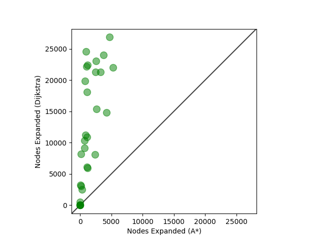
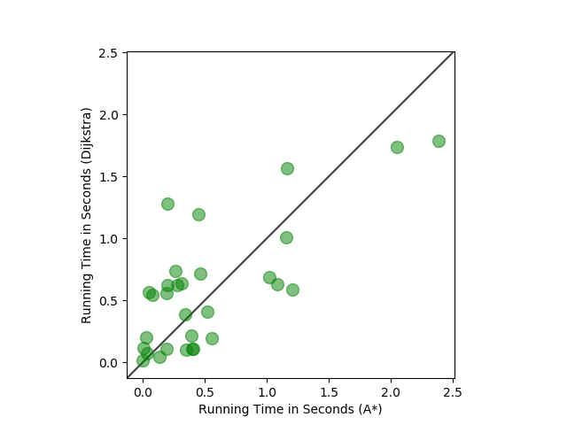
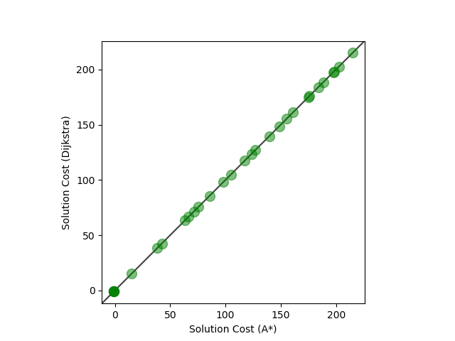

# Dijsktra-and-Astar
Implemented Dijkstra’s algorithm and A* (Astar) for solving pathfinding problems on video game maps.\
### Overview
Consider a grid environment where each action in the four cardinal direction (north,
south, east, and west) has the cost of 1.0 and each action in one of the four diagonal directions has the
cost of 1.5. Each search problem is defined by a video game map, a start location and a goal location.

### How to run:
```
pip install -r requirements.txt
python3 main.py –-testinstances
```

###  Scatter Plots - Results



